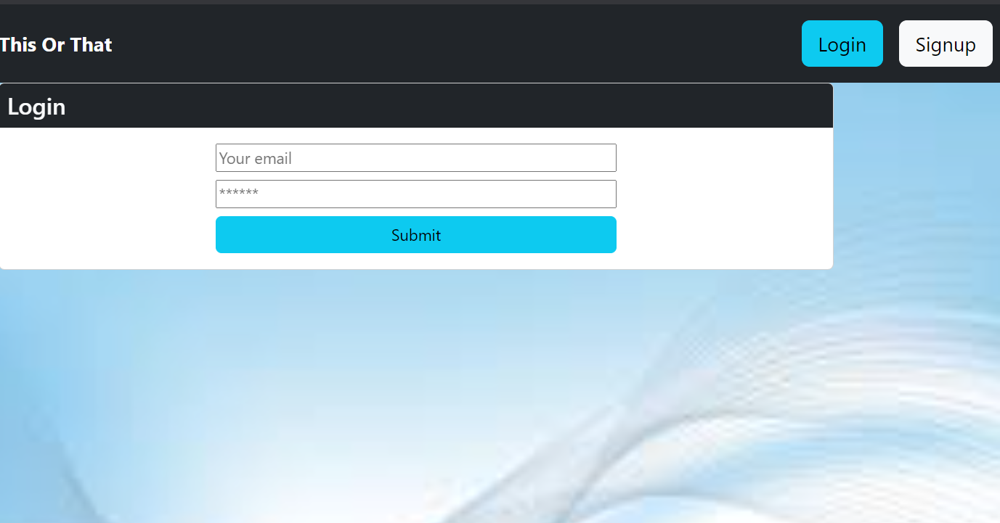
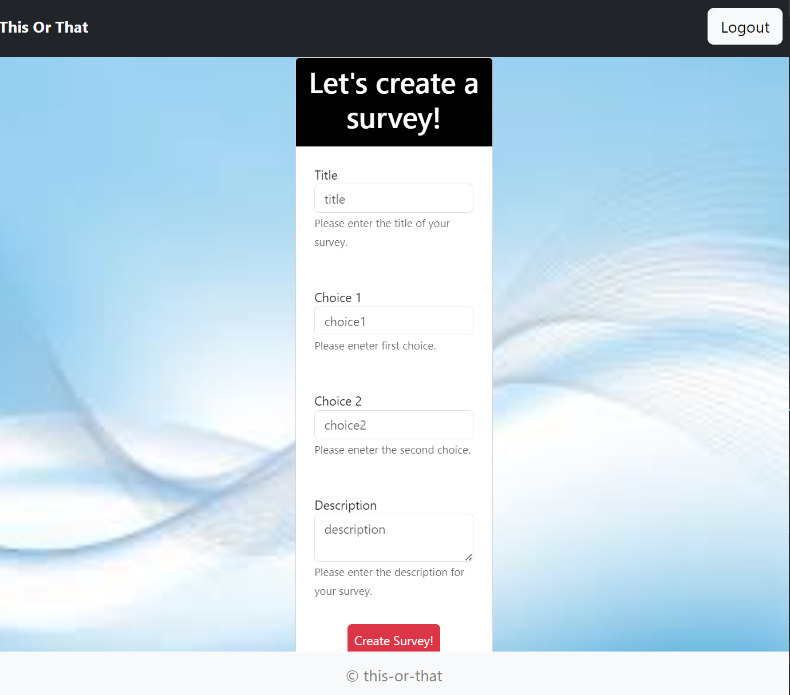
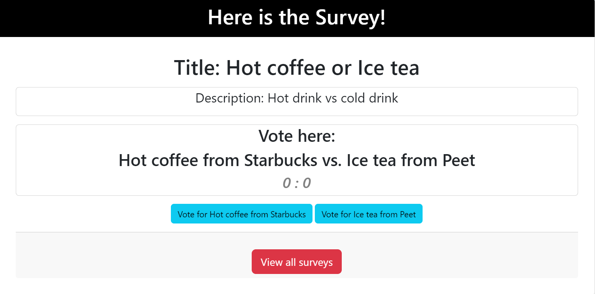

# This or That


Deployment Link: https://this-or-that-5dce821d9570.herokuapp.com/ 

## Description

This is a MERN stack multi-page project application that solves an issue of indecisevness and curiosity. User is able to create/delete surveys,vote on two choices and see which one is the most popular in survey page.

- The motivation behind this was to create something unique to solve the problem of choosing one choice or the other

## Table of Contents

* [Installation](#installation)

* [Technology](#technology)

* [Usage](#usage)

* [License](#license)

* [Contributing](#contributing)

* [Tests](#tests)

* [Questions](#questions)

## Installation

To install dependencies, run these commands:

```
npm install
```

## Technology
Technology used:
- MongoDB & Mongoose
- Node.js
- Express.js
- GraphSQL
- Apollo Server
- Bootstrap
- JWT token
- Heroku

## Usage
- User can sign up and login the application.



- User can create a survey.




- User can enter and vote in survey page.



## License

      Copyright © MIT. All rights reserved. 
      
      Licensed under the MIT license.

## Contributing

To make this project better, please fork the repo and create a pull request. You can also simply open an issue with the tag "enhancement".

* Fork the Project
* Create your Feature Branch (git checkout -b feature/AmazingFeature)
* Commit your Changes (git commit -m 'Add some AmazingFeature')
* Push to the Branch (git push origin feature/AmazingFeature)
* Open a Pull Request


## Tests

Run below command to seed the database:

```
npm run seed
```

## Questions
This project is contributed by:

[Anu](https://github.com/anud22)

[Ying](https://github.com/yul402/)

[Casper](https://github.com/info-hazard)

[Preston](https://github.com/pvongvilay)